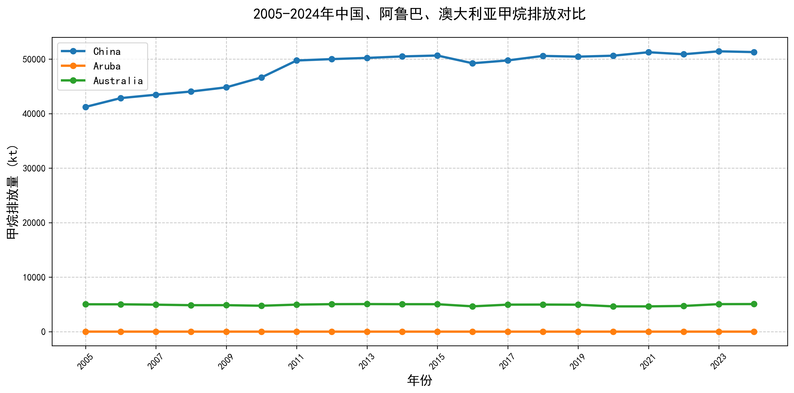
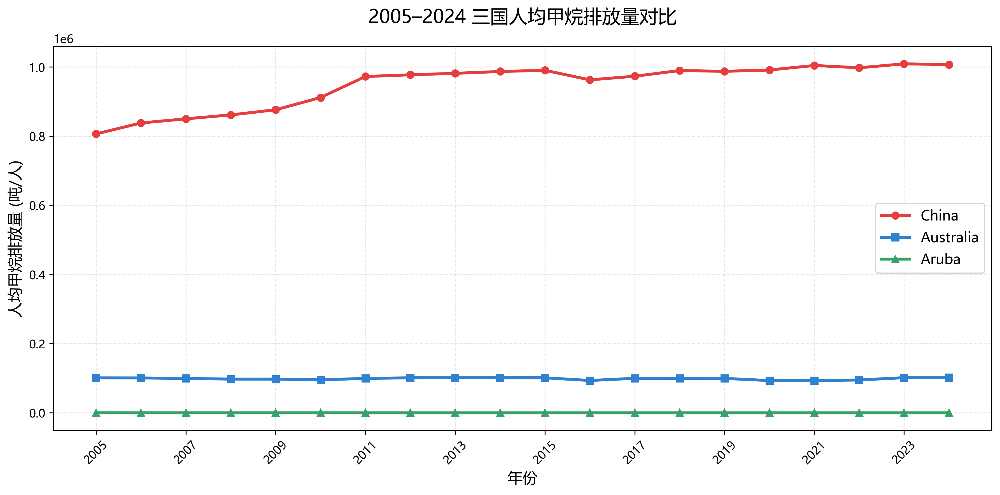
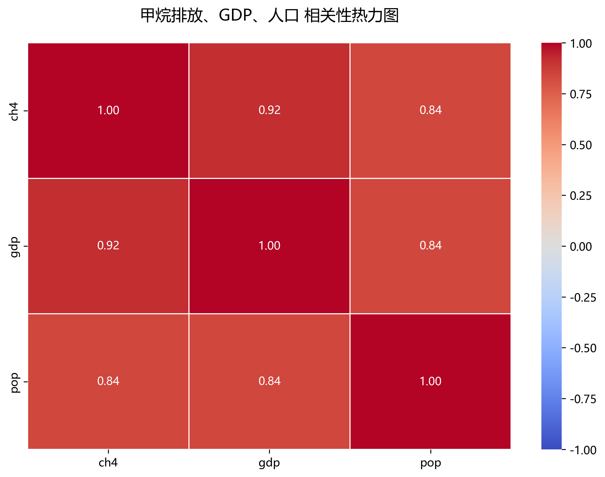
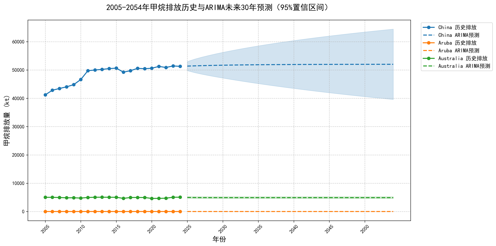

<!-- 全局样式（单独用HTML块包裹，避免YAML语法错误） -->

<!-- 标题区 -->
::: {.title-block}
# 中国、澳大利亚、阿鲁巴甲烷排放时空分析与未来30年预测
::: {.subtitle}
基于 EDGAR & World Bank 数据 | 时间序列预测 | 相关性分析可视化
:::
::: {.tags}
1. 甲烷排放
2. 时间序列预测
3. ARIMA
4. GDP与人口相关性
5. 三国对比
:::
:::

<!-- 项目简介卡片 -->
::: {.card}
## 📌 项目简介
本项目基于 2005-2024 年历史数据，对中国、澳大利亚、阿鲁巴三个国家的甲烷排放趋势进行分析。

通过数据清洗、宽表转长表、时间序列预测、相关性建模等完整复现流程，完成排放趋势对比、未来30年高精度预测、排放与经济社会指标关系研究。
:::

<!-- 数据来源卡片 -->
::: {.card}
## 📊 数据来源与处理
- **甲烷排放数据**：EDGAR 数据库（2005-2024）
- **GDP & 人口数据**：世界银行公开数据
- **数据格式**：宽表 → 长表（`country, year, ch4, gdp, pop`）
- **预测模型**：ARIMA（高精度时间序列预测）
:::

<!-- 历史排放趋势卡片 -->
::: {.card}
## 🐂 2005-2024 三国甲烷排放对比
三国排放总量呈现显著分层特征：
1. **中国**：排放总量最高，整体呈缓慢上升趋势，反映经济发展阶段的排放特征
2. **澳大利亚**：排放量中等，长期保持平稳，体现成熟经济体排放结构
3.  **阿鲁巴**：国家体量小，排放极低且稳定，对全球排放影响可忽略

::: {.figure}

:::
:::

<!-- 人均排放对比卡片 -->
::: {.card}
## 👥 三国人均甲烷排放对比
人均排放指标更公平地反映各国排放责任：
1. **中国**：人均排放较高，2010年后趋于平稳，减排政策逐步显现成效
2.  **澳大利亚**：人均排放长期稳定，呈现发达国家排放特征
3.  **阿鲁巴**：人均排放接近0，受限于极小的国家规模

::: {.figure}

:::
:::

<!-- 相关性分析卡片 -->
::: {.card}
## 🔗 甲烷排放与经济、人口相关性分析
通过皮尔逊相关系数热力图，量化排放与经济、人口的关联强度：
1.  甲烷排放与GDP相关系数：**0.92（极强正相关）**
2.  甲烷排放与人口相关系数：**0.84（强正相关）**
3.  GDP与人口相关系数：**0.84（强正相关）**

**核心结论**：经济规模是甲烷排放最核心的驱动因素，人口为重要基础条件。

::: {.figure}

:::
:::

<!-- 未来预测卡片 -->
::: {.card}
## 🔮 2025-2054 三国甲烷排放未来30年预测（ARIMA模型）
基于ARIMA时间序列模型，对三国未来30年甲烷排放进行高精度预测：
1.  **中国**：排放保持缓慢上升，增速逐步放缓
2.  **澳大利亚**：排放基本平稳，无明显增长
3.  **阿鲁巴**：维持极低排放水平，无显著变化

预测结果包含95%置信区间，为减排政策制定提供科学支撑。

::: {.figure}

:::
:::

<!-- 研究结论卡片 -->
::: {.card}
## ✅ 研究结论
::: {.conclusion}
1.  三国甲烷排放水平差异显著，核心受**国家规模、经济发展水平、人口总量**三大因素影响。
2.  甲烷排放与GDP、人口呈强正相关，**经济发展是排放增长的最核心驱动力**。
3.  人均排放指标更适合用于国际排放公平性比较，清晰展现不同发展阶段的排放特征。
4.  未来30年，中国排放将缓慢上升，澳大利亚与阿鲁巴保持稳定。
5.  甲烷减排政策应差异化制定：发展中国家需在经济增长中推进减排，发达国家需依托技术优势深化减排。
:::
:::

<!-- 复现流程卡片 -->
::: {.card}
## 🧪 项目完整复现流程

## 创建并激活虚拟环境
1. python -m venv .venv
2. .venv\Scripts\Activate.ps1

## 安装依赖
pip install -r requirements.txt

## 数据预处理
python src/01_data.py

## 生成图表
1. python src/02_ch4_trend.py
2. python src/03_ch4_forecast_arima.py
3. python src/04_ch4_correlation.py
4. python src/05_per_capita_ch4.py
5. python src/06_correlation_heatmap.py

## 渲染报告
quarto render docs/report.qmd --to html

# 团队分工
::: {.card}
1. 李淑慧（2025303110033）：数据预处理、可视化绘图
2. 余瑞（2025303120005）：数据分析、甲烷排放趋势图
3. 覃紫慧（2025303120142）：报告撰写、相关性分析

---

